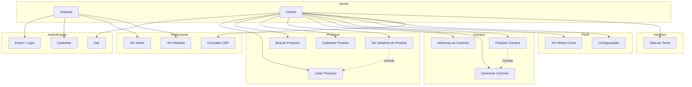

# Diagrama de Caso de Uso - Mercado Black

## Diagrama em Mermaid



## Casos de Uso Detalhados

### UC01 - Entrar / Login
- **Ator**: Visitante
- **Pré-condição**: Nenhuma
- **Fluxo principal**: Usuário informa credenciais (e-mail/senha ou Clerk) e acessa o sistema
- **Pós-condição**: Usuário autenticado, redirecionado para Home

### UC02 - Cadastrar
- **Ator**: Visitante
- **Pré-condição**: Nenhuma
- **Fluxo principal**: Usuário preenche nome, e-mail, senha, telefone e confirma
- **Pós-condição**: Conta criada, redirecionado para tela de login

### UC04 - Listar Produtos
- **Ator**: Cliente
- **Pré-condição**: Usuário autenticado
- **Fluxo principal**: Sistema exibe produtos do banco e demo
- **Pós-condição**: Produtos exibidos em grid

### UC05 - Buscar Produtos
- **Ator**: Cliente
- **Pré-condição**: Usuário autenticado
- **Fluxo principal**: Usuário digita termo na busca, sistema filtra por nome/descrição
- **Pós-condição**: Lista filtrada exibida

### UC06 - Cadastrar Produto
- **Ator**: Cliente (com token MySQL)
- **Pré-condição**: Login via e-mail/senha
- **Fluxo principal**: Usuário preenche nome, descrição, preço, URL da imagem e salva
- **Pós-condição**: Produto inserido no MySQL

### UC08 - Adicionar ao Carrinho
- **Ator**: Cliente
- **Pré-condição**: Produto selecionado
- **Fluxo principal**: Usuário define quantidade e clica em "Adicionar ao carrinho"
- **Pós-condição**: Item adicionado ao carrinho (localStorage)

### UC10 - Finalizar Compra
- **Ator**: Cliente
- **Pré-condição**: Carrinho com itens
- **Fluxo principal**: Usuário escolhe PIX/Cartão/Boleto, preenche dados, confirma. Sistema simula aprovação e exibe confetes
- **Pós-condição**: Carrinho limpo, tela de sucesso exibida

---

## Diagrama Simplificado (UML-style)

```
                    +------------------+
                    |   Mercado Black   |
                    +------------------+
     Visitante ----| Entrar            |
                   | Cadastrar         |
                   | Ver Sobre         |
                   | Ver Afiliados     |
     Cliente -----| Listar Produtos   |
                   | Buscar Produtos   |
                   | Cadastrar Produto |
                   | Ver Detalhes      |
                   | Adicionar Carrinho|
                   | Gerenciar Carrinho|
                   | Finalizar Compra  |
                   | Minha Conta       |
                   | Configurações     |
                   | Consultar CEP     |
                   | Alternar Tema     |
                    +------------------+
```
