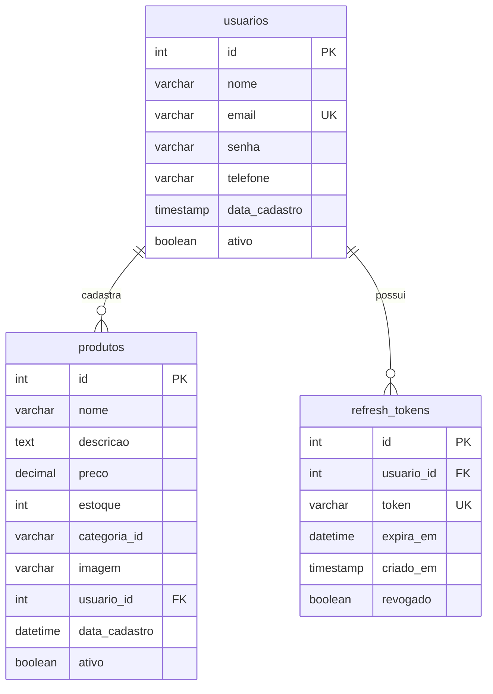

# Modelagem de Banco de Dados - Mercado Black

## 1. Diagrama Entidade-Relacionamento

---

## 2. Dicionário de Dados

### Tabela: `usuarios`

| Coluna       | Tipo        | Obrigatório | Descrição                    |
|--------------|-------------|-------------|------------------------------|
| id           | INT         | Sim (PK)    | Identificador único          |
| nome         | VARCHAR(100)| Sim         | Nome completo                |
| email        | VARCHAR(100)| Sim (UNIQUE)| E-mail de login              |
| senha        | VARCHAR(255)| Sim         | Hash bcrypt da senha         |
| telefone     | VARCHAR(15) | Sim         | Telefone                     |
| data_cadastro| TIMESTAMP   | Não         | Data/hora do cadastro        |
| ativo        | BOOLEAN     | Não         | Usuário ativo (default true) |

### Tabela: `produtos`

| Coluna       | Tipo          | Obrigatório | Descrição                    |
|--------------|---------------|-------------|------------------------------|
| id           | INT           | Sim (PK)    | Identificador único          |
| nome         | VARCHAR(150)  | Sim         | Nome do produto              |
| descricao    | TEXT          | Não         | Descrição detalhada          |
| preco        | DECIMAL(10,2) | Sim         | Preço em reais               |
| estoque      | INT           | Não         | Quantidade em estoque        |
| categoria_id | VARCHAR(80)   | Não         | Categoria (futuro)           |
| imagem       | VARCHAR(500)  | Não         | URL da imagem do produto     |
| usuario_id   | INT           | Não (FK)    | Quem cadastrou               |
| data_cadastro| DATETIME      | Não         | Data/hora do cadastro        |
| ativo        | BOOLEAN       | Não         | Produto ativo (default true) |

### Tabela: `refresh_tokens`

| Coluna   | Tipo      | Obrigatório | Descrição              |
|----------|-----------|-------------|------------------------|
| id       | INT       | Sim (PK)    | Identificador único    |
| usuario_id| INT      | Sim (FK)    | Referência ao usuário  |
| token    | VARCHAR(500)| Sim (UNIQUE)| Token de refresh       |
| expira_em| DATETIME  | Sim         | Data de expiração      |
| criado_em| TIMESTAMP | Não         | Data de criação        |
| revogado | BOOLEAN   | Não         | Token revogado         |

---

## 3. Relacionamentos

| Relacionamento | Tipo  | Cardinalidade | Descrição                          |
|----------------|-------|---------------|------------------------------------|
| usuarios → produtos | 1:N | 1 para muitos | Um usuário pode cadastrar vários produtos |
| usuarios → refresh_tokens | 1:N | 1 para muitos | Um usuário pode ter vários tokens |
| produtos.usuario_id → usuarios.id | FK | N:1 | Produto pertence a um usuário (opcional) |
| refresh_tokens.usuario_id → usuarios.id | FK | N:1 | Token pertence a um usuário |

---

## 4. Índices

| Índice                  | Tabela         | Coluna(s)     | Objetivo              |
|-------------------------|----------------|---------------|------------------------|
| PRIMARY                 | todas          | id            | Chave primária         |
| idx_usuarios_email      | usuarios       | email         | Busca por login        |
| idx_produtos_nome       | produtos       | categoria_id  | Filtros (ajustar para nome se necessário) |
| idx_refresh_tokens_token| refresh_tokens | token         | Validação de token     |
| idx_refresh_tokens_usuario| refresh_tokens| usuario_id    | Tokens por usuário     |

---

## 5. Regras de Integridade

- **usuarios.email**: UNIQUE (não permite duplicatas)
- **produtos.usuario_id**: ON DELETE SET NULL (se usuário for excluído, produto permanece)
- **refresh_tokens.usuario_id**: ON DELETE CASCADE (tokens excluídos com o usuário)
- **produtos.preco**: DECIMAL(10,2) garante precisão monetária
- **usuarios.senha**: Armazenada como hash bcrypt (nunca em texto puro)

---

## 6. Script SQL (Resumo)

O schema completo está em `backend/database/schemas.sql`.

- Banco: `Mercado_Black`
- Charset: `utf8mb4`
- Collation: `utf8mb4_unicode_ci`
